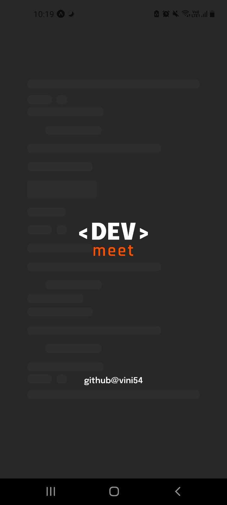
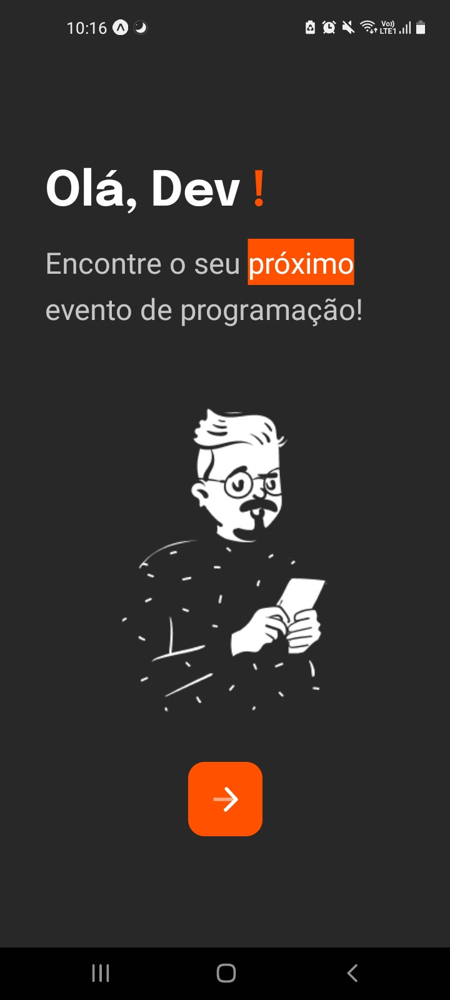
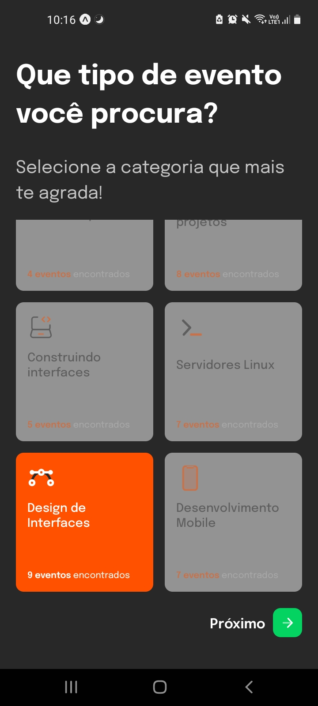
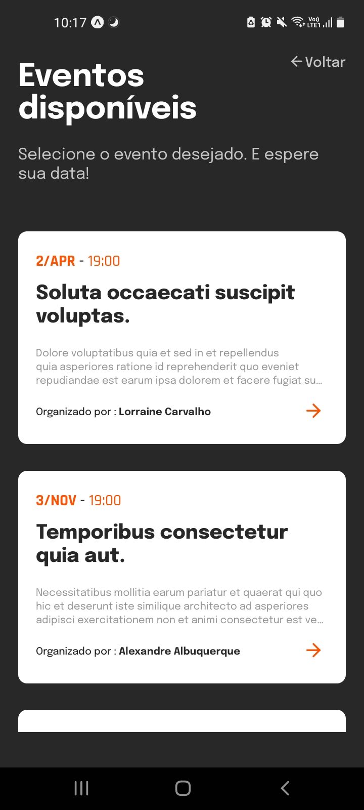
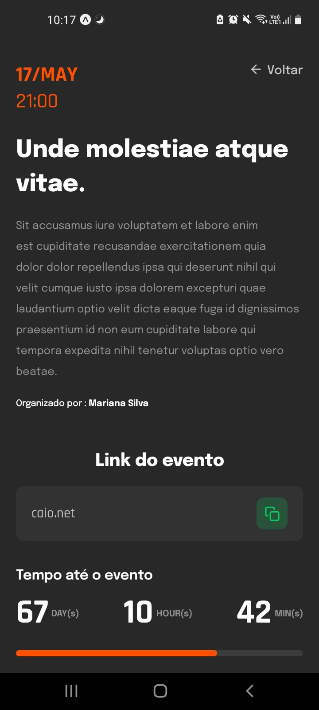
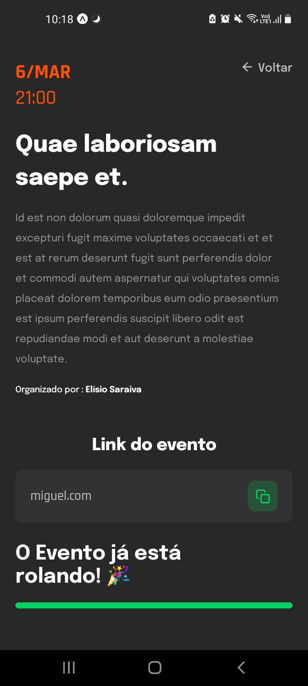

# Dev-meet

- [Tecnologias](#tecnologias) 
- [Layouts](#layouts) 

*desafio de react-native da comunidade Ballerini no discord*

## Tecnologias

- expo
- react-navigation (stack)
- typescript
- styled-components
  
*Back-end*
- axios fetch
- supabase database

## Layouts 

  
  
  
  
  
  
  
  
  
  
  
  
  

